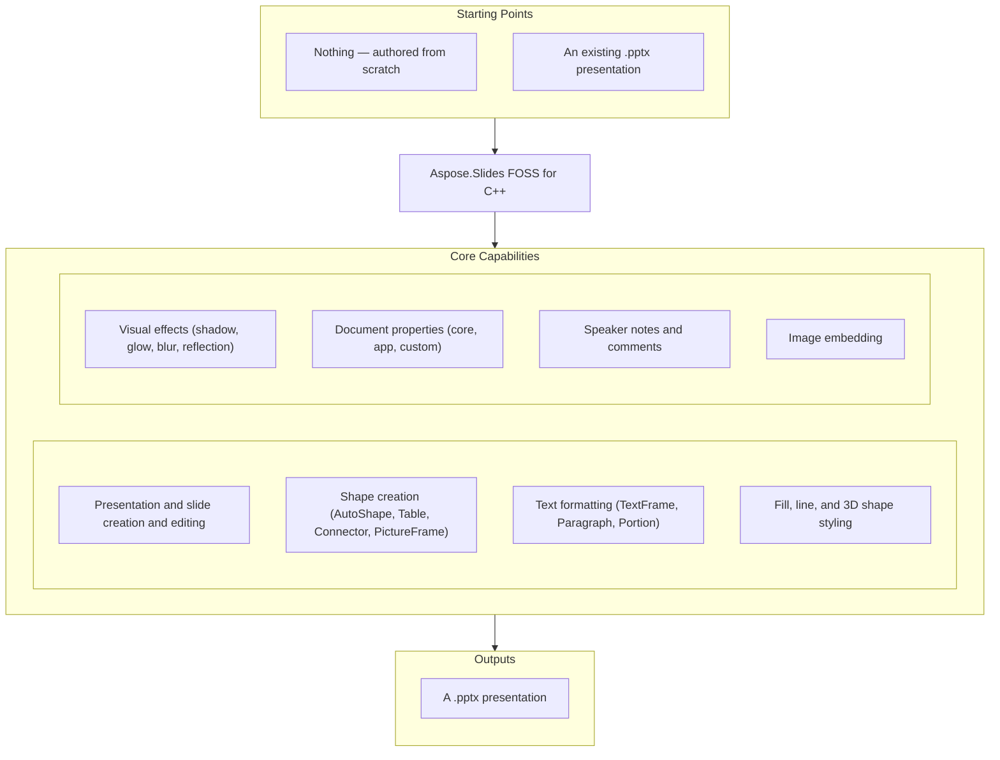

# Aspose.Slides FOSS for C++

[](LICENSE) [](CMakeLists.txt) [](https://www.nuget.org/packages/Aspose.Slides.Cpp.FOSS/) [](https://github.com/aspose-slides-foss/Aspose.Slides-FOSS-for-Cpp/graphs/contributors)

[](https://products.aspose.org/slides/cpp/)

Aspose.Slides FOSS for C++ is a free, open-source, MIT-licensed C++ library for creating, reading, and editing PowerPoint `.pptx` presentations. It integrates into CMake-based build systems via `FetchContent` and requires no Microsoft PowerPoint installation, COM interop, or other proprietary runtime.

## Navigation

- [At a Glance](#at-a-glance)
- [Key Capabilities](#key-capabilities)
- [Installation](#installation)
- [Dependencies](#dependencies)
- [Quick Start](#quick-start)
- [Additional Examples](#additional-examples)
- [API Reference](#api-reference)
- [Documentation & Resources](#documentation--resources)
- [Scope and Limitations](#scope-and-limitations)
- [Development and Testing](#development-and-testing)
- [License](#license)

## At a Glance



## Key Capabilities

This covers the same ground upstream calls Features — everything below is real, working public API:

- Open an existing `.pptx` presentation from a file path via `Presentation(path)`, or start a new
  one with the default `Presentation()` constructor — which begins with a single blank slide —
  then save with `Presentation.save(path, format)` to any of the six Office Open XML presentation
  formats `save()` writes (`Pptx`, `Pptm`, `Ppsx`, `Ppsm`, `Potx`, `Potm` — see
  [Scope and Limitations](#scope-and-limitations) for the rest of `SaveFormat`). Unknown XML parts
  encountered on load are preserved verbatim on save, so opening and re-saving a file never strips
  content this library does not yet understand.
- Manage slides through `SlideCollection` — add a new empty slide with `add_empty_slide()`, remove
  a slide with `remove()`/`remove_at()`, and iterate the collection directly; `add_clone()`/
  `insert_clone()` register a cloned slide, but see
  [Scope and Limitations](#scope-and-limitations) for a real defect in what survives the clone.
- Insert AutoShapes, Tables, Connectors, and PictureFrames onto a `Slide` through its
  `ShapeCollection` (`add_auto_shape()`, `add_table()`, `add_connector()`, `add_picture_frame()`);
  reordering shapes within a slide is `ShapeCollection::reorder()`, and traverse nested shapes
  inside a loaded `GroupShape` via its own `shapes()` collection.
- Format text at the character, paragraph, and text-frame level through `TextFrame`, `Paragraph`,
  and `Portion` — set bold, italic, underline, font size, and highlight color via `PortionFormat`;
  alignment, spacing, indentation, and margins via `Paragraph::paragraph_format()`; text-frame
  wrapping, anchoring, columns, and autofit via `TextFrame::text_frame_format()`; and bullet
  character, numbering, or picture bullets via `BulletFormat`.
- Apply solid, gradient, pattern, or picture fills to any shape's `FillFormat`, and control outline
  width, dash style, cap style, compound style, join style, arrowheads, and alignment through
  `LineFormat`.
- Add outer shadow, inner shadow, preset shadow, glow, blur, soft edge, and reflection effects to a
  shape via its `EffectFormat`.
- Configure a shape's 3D appearance — bevel, camera angle, light rig, material, and extrusion depth
  — through `ThreeDFormat`.
- Read and write core, application, and custom document properties (title, author, category, and
  typed custom values) via `DocumentProperties`.
- Add per-slide speaker notes through `NotesSlideManager.add_notes_slide()`, manage notes-slide
  header/footer/date-time placeholders via `NotesSlideHeaderFooterManager`, and add comments —
  with authors, timestamps, and positions — via `CommentAuthorCollection` and `CommentCollection`;
  a reply is `set_parent_comment()`-linked and round-trips as a `p15:parentCm` extension on the
  classic comment list, not as a `ppt/threadedComments/` part (see
  [Scope and Limitations](#scope-and-limitations)).
- Embed images from an in-memory byte buffer via `ImageCollection.add_image()` — read a file or
  stream into bytes first, since only the byte-buffer overload exists — then attach the result to
  a slide as a `PictureFrame` via `add_picture_frame()`.

## Installation

Build from source with CMake on any platform — it ships as CMake source you build and link
directly — or, on Windows with MSVC, install the prebuilt NuGet package.

### Build From Source

```bash
cmake -B build -DCMAKE_BUILD_TYPE=Release
cmake --build build
```

Dependencies are fetched automatically via CMake `FetchContent`:

- [pugixml](https://github.com/zeux/pugixml) v1.14 — XML parsing
- [miniz](https://github.com/richgel999/miniz) 3.0.2 — ZIP archive I/O
- [GoogleTest](https://github.com/google/googletest) v1.15.2 — Testing (build only)

Requires a C++20 compiler and CMake 3.20+ (`CMAKE_CXX_STANDARD 20` is set in `CMakeLists.txt`).

### Consume via CMake FetchContent

To pull the library directly into your own CMake project instead of building it standalone:

```cmake
include(FetchContent)
FetchContent_Declare(
  aspose_slides_foss
  GIT_REPOSITORY https://github.com/aspose-slides-foss/Aspose.Slides-FOSS-for-Cpp.git
  GIT_TAG main
)
FetchContent_MakeAvailable(aspose_slides_foss)
target_link_libraries(your_target PRIVATE aspose_slides_foss)
```

`CMakeLists.txt` exposes its `include/` directory as a `PUBLIC` include path on the
`aspose_slides_foss` target, so no separate `target_include_directories()` call is needed.

### Install and Use the Installed Package

```bash
cmake -B build -DCMAKE_BUILD_TYPE=Release -DCMAKE_INSTALL_PREFIX=/your/prefix
cmake --build build
cmake --install build
```

The prefix then contains the headers, the static library, a generated
`Aspose/Slides/Foss/version.h`, a CycloneDX bill of materials, and a CMake package configuration.
A consumer needs nothing but the prefix:

```cmake
cmake_minimum_required(VERSION 3.20)
project(my_app LANGUAGES CXX)

find_package(AsposeSlidesFoss CONFIG REQUIRED)

add_executable(my_app main.cpp)
target_link_libraries(my_app PRIVATE AsposeSlidesFoss::AsposeSlidesFoss)
```

```bash
cmake -B build -DCMAKE_PREFIX_PATH=/your/prefix
```

`examples/consumer/` is exactly that project, and it is built and run against a fresh install on
every CI run, so the instructions above are checked rather than asserted.

Version compatibility is `SameMinorVersion`. The version is CalVer — `YY.M.PATCH` — so the major
number is a year and carries no compatibility meaning at all:
`find_package(AsposeSlidesFoss 26.9 CONFIG REQUIRED)` accepts any `26.9.x` and rejects `26.10`,
which is the only promise a monthly release train can keep.

**A consumer needs pugixml's headers, not just its library.** 44 of the headers a consumer
includes — everything under `include/Aspose/Slides/Foss/` outside `_internal/` — include
`<pugixml.hpp>`, and 37 of them keep a `pugi::xml_node` as a data member. The installed
`AsposeSlidesFossConfig.cmake` calls `find_dependency(pugixml)` for that reason; if the library
was built with a fetched pugixml rather than an installed one, that pugixml is installed into the
same prefix alongside it, so `find_dependency` resolves either way. This is a leak of an
implementation detail into the interface, disclosed here rather than quietly fixed because the fix
is not small — see [Scope and Limitations](#scope-and-limitations) for the real scale of it. miniz
has no such problem: it appears in no installed header, is linked privately, and is required only
at link time.

### Install From NuGet on Windows

On Windows with MSVC there is a prebuilt package, so nothing has to be compiled:

```powershell
Install-Package Aspose.Slides.Cpp.FOSS
```

It carries **x64 and Win32**, **Debug and Release**, built against the DLL C runtime (`/MD` and
`/MDd`), and it needs no other configuration: the include path and the libraries arrive from the
package. Two requirements, both checked by the package rather than left to fail obscurely:

- **Visual Studio 2022 or newer (`v143`+).** These are static archives compiled against a
  particular MSVC standard library, part of which is itself compiled rather than header-only. An
  older toolset links against an older standard library that lacks symbols these objects
  reference, and fails with `LNK2019` on a name from inside the standard library. The package is
  therefore built with the *oldest* toolset it supports, never the newest available.
- **C++ language standard `stdcpp20` or later**, because these headers are C++20.

Three libraries are linked, not one — `aspose_slides_foss.lib`, `pugixml.lib` and `miniz.lib` —
and pugixml's headers are on your include path as well as ours. A static archive carries no record
of what it needs, and pugixml is in this library's public interface; see
[Scope and Limitations](#scope-and-limitations).

For Linux and macOS, build from source as above. `packaging/README.md` describes the package for
each registry and what state it is in.

## Dependencies

### Required Package Dependencies

Each dependency is looked for as an installed package first (`find_package(... CONFIG QUIET)`) and
fetched with CMake `FetchContent` only if it is not found, so a package manager's copy is always
preferred to a private clone:

- `pugixml` v1.14 — XML parsing. A consumer needs its headers too — see
  [Installation](#installation).
- `miniz` 3.0.2 — ZIP archive I/O, linked privately and needed only at link time.

### Native and System Requirements

- A C++20 compiler and CMake 3.20+ (`cmake_minimum_required(VERSION 3.20)` and
  `CMAKE_CXX_STANDARD 20` in `CMakeLists.txt`).
- The Windows NuGet package needs Visual Studio 2022 or newer (`v143`+) and the C++ language
  standard `stdcpp20` or later; the package's own MSBuild targets check both.
- The library is built as a static archive (`add_library(AsposeSlidesFoss STATIC ...)`): nothing in
  the sources is annotated for symbol export, so a shared build would export nothing, and the build
  forces the static form rather than producing a library that cannot be linked.

### Development Dependencies

- `googletest` v1.15.2 — test framework used by the `tests/` projects (build only, fetched
  automatically via CMake `FetchContent`).

## Quick Start

Create a presentation, add a rectangle with text, and save it to `.pptx`:

```cpp
#include <Aspose/Slides/Foss/presentation.h>
#include <Aspose/Slides/Foss/shape_type.h>
#include <Aspose/Slides/Foss/auto_shape.h>
#include <Aspose/Slides/Foss/export/save_format.h>

using namespace Aspose::Slides::Foss;

int main() {
    // Create a new presentation (starts with one blank slide).
    Presentation pres;
    auto& slide = pres.slides()[0];

    // Add a rectangle and set its text.
    auto& shape = slide.shapes().add_auto_shape(ShapeType::RECTANGLE, 50, 50, 400, 150);
    shape.add_text_frame("Hello, Aspose.Slides!");

    pres.save("output.pptx", SaveFormat::PPTX);
    return 0;
}
```

`presentation.h` is not enough on its own — it forward-declares the types its collections return,
so reaching through `slides()[0].shapes()` needs `slide.h` and `shape_collection.h` as well, and
using what a factory hands back needs that type's header too. Every example on this page lists
exactly what it needs; a missing one shows up as *use of undefined type* rather than as a missing
function.

Opening and modifying an existing file works the same way, using the path constructor:

```cpp
Presentation existing("input.pptx");
existing.slides()[0].shapes().add_auto_shape(ShapeType::ELLIPSE, 100, 100, 200, 200);
existing.save("modified.pptx", SaveFormat::PPTX);
```

## Additional Examples

### Format Text and Apply a Fill Effect

Text formatting works at the `Portion` level — the smallest unit of a run of characters. Shape
fill is independent: set the fill type to solid and assign a color.

```cpp
#include <Aspose/Slides/Foss/presentation.h>
#include <Aspose/Slides/Foss/shape_type.h>
#include <Aspose/Slides/Foss/auto_shape.h>
#include <Aspose/Slides/Foss/fill_type.h>
#include <Aspose/Slides/Foss/nullable_bool.h>
#include <Aspose/Slides/Foss/drawing/color.h>
#include <Aspose/Slides/Foss/export/save_format.h>

using namespace Aspose::Slides::Foss;
using namespace Aspose::Slides::Foss::Drawing;

Presentation pres;
auto& shape = pres.slides()[0].shapes().add_auto_shape(ShapeType::RECTANGLE, 50, 50, 400, 150);
auto& tf = shape.add_text_frame("Formatted text");
auto& fmt = tf.paragraphs()[0].portions()[0].portion_format();
fmt.set_font_height(24.0);
fmt.set_font_bold(NullableBool::TRUE);
shape.fill_format().set_fill_type(FillType::SOLID);
shape.fill_format().solid_fill_color().set_color(Color::from_argb(255, 0, 70, 127));
pres.save("text.pptx", SaveFormat::PPTX);
```

<details>
<summary>View Additional Examples</summary>

### Table With a Colored, Bordered Cell

`Table::rows()`/`columns()` return `RowCollection`/`ColumnCollection`; each `Cell` exposes
`text_frame()` and `cell_format()` to set its content and appearance:

```cpp
#include <Aspose/Slides/Foss/presentation.h>
#include <Aspose/Slides/Foss/table.h>
#include <Aspose/Slides/Foss/fill_type.h>
#include <Aspose/Slides/Foss/drawing/color.h>
#include <Aspose/Slides/Foss/export/save_format.h>

using namespace Aspose::Slides::Foss;
using namespace Aspose::Slides::Foss::Drawing;

Presentation pres;
std::vector<double> col_widths = {150, 150};
std::vector<double> row_heights = {50};
auto& table = pres.slides()[0].shapes().add_table(50, 50, col_widths, row_heights);
auto& cell = table.rows()[0][0];
cell.text_frame()->set_text("Blue");
cell.cell_format().fill_format().set_fill_type(FillType::SOLID);
cell.cell_format().fill_format().solid_fill_color().set_color(Color::light_blue);
pres.save("table.pptx", SaveFormat::PPTX);
```

### Connector Between Two Shapes

`ShapeCollection::add_connector()` returns a `Connector&`; connect it to two other shapes by
reference (not by address) and pick the connection-site index on each end:

```cpp
#include <Aspose/Slides/Foss/presentation.h>
#include <Aspose/Slides/Foss/shape_type.h>
#include <Aspose/Slides/Foss/auto_shape.h>
#include <Aspose/Slides/Foss/connector.h>
#include <Aspose/Slides/Foss/export/save_format.h>

using namespace Aspose::Slides::Foss;

Presentation pres;
auto& slide = pres.slides()[0];
auto& box1 = slide.shapes().add_auto_shape(ShapeType::RECTANGLE, 50, 100, 150, 60);
auto& box2 = slide.shapes().add_auto_shape(ShapeType::RECTANGLE, 350, 100, 150, 60);
auto& conn = slide.shapes().add_connector(ShapeType::BENT_CONNECTOR3, 0, 0, 10, 10);
conn.set_start_shape_connected_to(&box1);
conn.set_start_shape_connection_site_index(3);
conn.set_end_shape_connected_to(&box2);
conn.set_end_shape_connection_site_index(1);
pres.save("connector.pptx", SaveFormat::PPTX);
```

### Outer Shadow Effect

`EffectFormat::enable_outer_shadow_effect()` activates the effect; `outer_shadow_effect()` then
returns a pointer to the now-live `OuterShadow` settings object:

```cpp
#include <Aspose/Slides/Foss/presentation.h>
#include <Aspose/Slides/Foss/shape_type.h>
#include <Aspose/Slides/Foss/auto_shape.h>
#include <Aspose/Slides/Foss/drawing/color.h>
#include <Aspose/Slides/Foss/export/save_format.h>

using namespace Aspose::Slides::Foss;
using namespace Aspose::Slides::Foss::Drawing;

Presentation pres;
auto& shape = pres.slides()[0].shapes().add_auto_shape(ShapeType::RECTANGLE, 100, 100, 200, 100);
auto& ef = shape.effect_format();
ef.enable_outer_shadow_effect();
auto* shadow = ef.outer_shadow_effect();
shadow->set_blur_radius(10);
shadow->set_direction(315);
shadow->set_distance(8);
shadow->shadow_color().set_color(Color::from_argb(128, 0, 0, 0));
pres.save("shadow.pptx", SaveFormat::PPTX);
```

### Speaker Notes

Add a notes slide through `NotesSlideManager`, then set its text via `notes_text_frame()`:

```cpp
#include <Aspose/Slides/Foss/presentation.h>
#include <Aspose/Slides/Foss/notes_slide_manager.h>
#include <Aspose/Slides/Foss/notes_slide.h>
#include <Aspose/Slides/Foss/text_frame.h>
#include <Aspose/Slides/Foss/export/save_format.h>

using namespace Aspose::Slides::Foss;

Presentation pres;
auto* notes = pres.slides()[0].notes_slide_manager().add_notes_slide();
notes->notes_text_frame().set_text("Speaker notes go here.");
pres.save("notes.pptx", SaveFormat::PPTX);
```

### Comments and Replies

Add a comment through `CommentAuthorCollection`/`CommentCollection`, then a reply linked to it via
`set_parent_comment()` — the reply is written into the same classic comment list, carrying a
`p15:parentCm` in its extension list, not a separate `ppt/threadedComments/` part:

```cpp
#include <Aspose/Slides/Foss/presentation.h>
#include <Aspose/Slides/Foss/comment_author_collection.h>
#include <Aspose/Slides/Foss/comment_author.h>
#include <Aspose/Slides/Foss/comment_collection.h>
#include <Aspose/Slides/Foss/comment.h>
#include <Aspose/Slides/Foss/drawing/point_f.h>
#include <Aspose/Slides/Foss/export/save_format.h>
#include <chrono>

using namespace Aspose::Slides::Foss;
using namespace Aspose::Slides::Foss::Drawing;

Presentation pres;
auto& author = pres.comment_authors().add_author("Jane Smith", "JS");
auto& slide = pres.slides()[0];

auto& comment = author.comments().add_comment(
    "Review this slide", slide, PointF(2.0f, 2.0f),
    std::chrono::system_clock::now());

auto& reply = author.comments().add_comment(
    "Agreed", slide, PointF(2.5f, 2.5f), std::chrono::system_clock::now());
reply.set_parent_comment(&comment);

pres.save("comments.pptx", SaveFormat::PPTX);
```

### Document Properties

```cpp
#include <Aspose/Slides/Foss/presentation.h>
#include <Aspose/Slides/Foss/document_properties.h>
#include <Aspose/Slides/Foss/export/save_format.h>

using namespace Aspose::Slides::Foss;

Presentation pres;
pres.document_properties().set_title("Q1 Results");
pres.document_properties().set_author("Finance Team");
pres.document_properties().set_custom_property_value("Version", 3);
pres.save("deck.pptx", SaveFormat::PPTX);
```

</details>

## API Reference

The primary entry point is `Presentation`, which owns a `SlideCollection` of `Slide` objects; each
`Slide` exposes its shapes through `ShapeCollection` and its per-slide notes through
`NotesSlideManager`.

<details>
<summary>View the Core API Surface</summary>

### Foss

| Class | Description |
|---|---|
| `AdjustValue` | Represents a geometry shape's adjustment value. |
| `AdjustValueCollection` | Represents a collection of shape's adjustments. |
| `AppPropertiesPart` | Parse/serialize docProps/app.xml. |
| `AuthorData` | Raw data for a comment author parsed from XML. |
| `AutoShape` | Represents an AutoShape. |
| `BaseHandoutNotesSlideHeaderFooterManager` | Base class for handout and notes slide header/footer managers. |
| `BasePortionFormat` | Common text portion formatting properties. |
| `BaseShapeLock` | Base class for shape locks that determine which operations are disabled on a shape. |
| `Blur` | Represents a blur effect applied to the entire shape, including its fill. |
| `BulletFormat` | Represents paragraph bullet formatting properties. |
| `Camera` | Represents camera properties for 3D scene rendering. |
| `Cell` | Represents a cell in a table. |
| `CellCollection` | Represents a collection of table cells. |
| `CellFormat` | Represents formatting for a table cell. |
| `Color` | Represents an ARGB color, equivalent to System.Drawing.Color. |
| `ColorFormat` | Represents a color used in a presentation. |
| `Column` | Represents a column in a table. |
| `ColumnCollection` | Represents collection of columns in a table. |
| `ColumnFormat` | Represents formatting properties for a table column. |
| `Comment` | Represents a comment on a slide. |
| `CommentAuthor` | Represents the author of a comment. |
| `CommentAuthorCollection` | Manages a collection of comment authors in a presentation. |
| `CommentAuthorsPart` | Manages the comment authors XML part (`ppt/commentAuthors.xml`). |
| `CommentCollection` | Manages a collection of comments belonging to a single author. |
| `CommentData` | Raw data for a single comment parsed from XML. |
| `CommentsPart` | Manages a slide comments XML part (`ppt/comments/slideN.xml`). |
| `Connector` | Represents a connector shape that links two shapes. |
| `ContentTypesManager` | Manages the [Content_Types].xml part, which maps part names to MIME types. |
| `CorePropertiesPart` | Parse/serialize docProps/core.xml (Dublin Core metadata). |
| `CustomPropertiesPart` | Parse and serialize docProps/custom.xml. |
| `DocumentProperties` | Represents properties of a presentation. |
| `EffectFormat` | Represents effect properties of a shape (shadow, glow, blur, etc.). |
| `ExporterBase` | Abstract base class for presentation format exporters. |
| `ExporterRegistry` | Central registry for format exporters. |
| `FillFormat` | Represents the fill formatting properties of a shape. |
| `FillOverlay` | Represents a Fill Overlay effect. |
| `FontData` | Represents font information used in a presentation. |
| `GlobalLayoutSlideCollection` | Represents a collection of all layout slides in a presentation. |
| `Glow` | Represents a glow effect, in which a color blurred outline is added outside the edges of the object. |
| `GradientFormat` | Represents gradient fill formatting. |
| `GradientStop` | Represents a gradient stop within a gradient fill. |
| `GradientStopCollection` | Represents a collection of gradient stops. |
| `GraphicalObjectLock` | Concrete locking properties for a graphical object. |
| `GroupShape` | Represents a group shape that contains a nested collection of shapes. |
| `HeadingPair` | Represents a 'Heading pair' property of the document. |
| `Image` | Represents a raster or vector image backed by in-memory data. |
| `ImageCollection` | Manages the collection of images in a presentation. |
| `ImageTransformOperation` | Base class for image transform operations that participate in property value inheritance via PVIObject. |
| `Images` | Factory methods to create IImage instances. |
| `InMemoryOpcPackage` | In-memory OPC package with ZIP file I/O support. |
| `InnerShadow` | Represents an inner shadow effect applied to a shape. |
| `LayoutSlide` | Represents a layout slide. |
| `LayoutSlideCollection` | Manages a collection of layout slides belonging to a master slide. |
| `LayoutSlidePart` | Manages a layout slide XML part (ppt/slideLayouts/slideLayoutN.xml). |
| `LightRig` | Represents light rig properties for 3D scene rendering. |
| `LineFillFormat` | Represents the fill properties of a line. |
| `LineFormat` | Represents the line (outline) formatting properties. |
| `MasterLayoutSlideCollection` | Represents a collection of all layout slides of a defined master slide. |
| `MasterSlide` | Represents a master slide in a presentation. |
| `MasterSlideCollection` | Manages the collection of master slides in a presentation. |
| `MasterSlidePart` | Manages a master slide XML part (ppt/slideMasters/slideMasterN.xml). |
| `NotesSize` | Specifies the size of the notes slide. |
| `NotesSlide` | Represents a notes slide associated with a presentation slide. |
| `NotesSlideHeaderFooterManager` | Manages the behavior of notes slide placeholders including header, footer, date-time, and slide number. |
| `NotesSlideManager` | Manages the notes slide associated with a presentation slide. |
| `NotesSlidePart` | Manages a notes slide XML part (ppt/notesSlides/notesSlideN.xml). |
| `NotesSlidePart-Aspose_Slides_Foss` | Internal representation of a notes slide's placeholder storage. |
| `OpcPackage` | Abstract interface for an OPC package that stores named parts as byte arrays. |
| `OuterShadow` | Represents an outer shadow effect applied to a shape. |
| `PPImage` | Represents an image stored in a presentation. |
| `Paragraph` | Represents a text paragraph within a text frame. |
| `ParagraphCollection` | Manages a collection of paragraphs within a text frame. |
| `ParagraphFormat` | Represents paragraph formatting properties. |
| `PatternFormat` | Represents a pattern fill format. |
| `Picture` | Represents a picture in a presentation. |
| `PictureFillFormat` | Represents a picture fill within a fill format. |
| `PictureFrame` | Represents a picture frame shape containing an image. |
| `PictureFrameLock` | Determines which operations are disabled on the parent PictureFrame. |
| `Portion` | Represents a text portion (run) within a paragraph. |
| `PortionCollection` | Manages a collection of text portions within a paragraph. |
| `PortionFormat` | Represents text portion formatting properties with write access. |
| `PptxExporter` | Exporter for PPTX and related Office Open XML formats. |
| `PptxExporterFactory` | Factory for creating PPTX exporters with specific target formats. |
| `Presentation` | Represents a Microsoft PowerPoint presentation. |
| `PresetShadow` | Represents a preset shadow effect applied to a shape. |
| `Reflection` | Represents a reflection effect applied to a shape. |
| `RelationshipsManager` | Manages the .rels file associated with a given OPC part. |
| `Row` | Represents a row in a table. |
| `RowCollection` | Represents collection of rows in a table. |
| `RowFormat` | Represents formatting properties for a table row. |
| `Shape` | Base class for all shapes on a slide. |
| `ShapeBevel` | Represents the bevel properties of a shape's 3D surface. |
| `ShapeCollection` | Manages the collection of shapes on a slide. |
| `ShapeFrame` | Represents the geometric frame of a shape. |
| `SimpleColorFormat` | A simple concrete implementation of ColorFormat backed by an sRGB color. |
| `Slide` | Represents a slide in a presentation. |
| `SlideCollection` | Manages the collection of slides in a presentation. |
| `SlidePart` | Manages a slide XML part (ppt/slides/slideN.xml). |
| `SoftEdge` | Represents a soft edge effect applied to a shape. |
| `Table` | Represents a table shape on a slide. |
| `TableFormat` | Represents table formatting properties. |
| `TextFrame` | Represents a TextFrame containing paragraphs of text. |
| `TextFrameFormat` | Represents text frame formatting properties. |
| `ThreeDFormat` | Represents 3D formatting properties of a shape. |
| `XmlElement` | Lightweight in-memory XML element for OOXML manipulation. |

#### Structs

| Struct | Description |
|---|---|
| `Attributes` | Common PPTX attribute names. |
| `Elements` | Common PPTX element names with full namespace qualification. |
| `HeadingPairData` | Internal representation of a heading pair (name + count). |
| `MasterReference` | Represents a master reference entry from presentation.xml (sldMasterIdLst). |
| `Ns` | Namespace helper providing Clark-notation formatted strings ("{uri}"). |
| `ParagraphFormatSource` | Tagged wrapper for paragraph format source. |
| `PointF` | Represents a 2D point with float coordinates, equivalent to System.Drawing.PointF. |
| `PortionFormatSource` | Tagged wrapper so the dispatcher knows which applier to invoke. |
| `RectangleF` | Represents a rectangle with float coordinates, equivalent to System.Drawing.RectangleF. |
| `Relationship` | A single OPC relationship entry. |
| `Size` | Represents a 2D size with integer dimensions, equivalent to System.Drawing.Size. |
| `SizeF` | Represents a 2D size with float dimensions, equivalent to System.Drawing.SizeF. |
| `SlideReference` | Represents a slide reference entry from presentation.xml (sldIdLst). |
| `TextFrameFormatSource` | Tagged wrapper for text-frame format source. |
| `XmlWriter` | Struct with 1 method and 1 property. |

#### Enumerations

| Enumeration | Description |
|---|---|
| `BevelPresetType` | Constants which define 3D bevel of shape. |
| `BulletType` | Represents the type of the extended bullets. |
| `CameraPresetType` | Constants which define camera preset type. |
| `ColorType` | Represents different color modes. |
| `FillBlendMode` | Determines blend mode. |
| `FillType` | Specifies the interior fill type of various visual objects. |
| `FontAlignment` | Represents vertical font alignment. |
| `GradientDirection` | Represents the gradient style. |
| `GradientShape` | Represents the shape of gradient fill. |
| `LightRigPresetType` | Constants which define light preset types. |
| `LightingDirection` | Constants which define light directions. |
| `LineAlignment` | Represents the lines alignment type. |
| `LineArrowheadLength` | Represents the length of an arrowhead. |
| `LineArrowheadStyle` | Represents the style of an arrowhead. |
| `LineArrowheadWidth` | Represents the width of an arrowhead. |
| `LineCapStyle` | Represents the line cap style. |
| `LineDashStyle` | Represents the line dash style. |
| `LineJoinStyle` | Represents the lines join style. |
| `LineStyle` | Represents the style of a line. |
| `MaterialPresetType` | Constants which define material of shape. |
| `NullableBool` | Represents triple boolean values. |
| `NumberedBulletStyle` | Represents the style of the numbered bullets. |
| `PatternStyle` | Represents the pattern style. |
| `PictureFillMode` | Determines how picture will fill area. |
| `PresetColor` | Represents predefined color presets. |
| `PresetShadowType` | Represents a preset for a shadow effect. |
| `RectangleAlignment` | Defines 2-dimension alignment. |
| `SaveFormat` | Constants which define the format of a saved presentation. |
| `SchemeColor` | Represents colors in a color scheme. |
| `ShapeType` | Represents preset geometry of shapes. |
| `SlideLayoutType` | Represents the slide layout type. |
| `SourceFormat` | Represents source file format. |
| `TableStylePreset` | Represents builtin table styles. |
| `TextAlignment` | Represents different text alignment styles. |
| `TextAnchorType` | Text box alignment within a text area. |
| `TextAutofitType` | Represents text autofit mode. |
| `TextCapType` | Represents the type of text capitalisation. |
| `TextShapeType` | Represents text wrapping shape. |
| `TextStrikethroughType` | Represents the type of text strikethrough. |
| `TextUnderlineType` | Represents the type of text underline. |
| `TextVerticalType` | Determines vertical writing mode for a text. |
| `TileFlip` | Defines tile flipping mode. |

---

#### Detailed Member Reference

### Presentation and Slides

- `Presentation`
  - `Presentation()` — new presentation with one blank slide / `Presentation(path)` — load a `.pptx`
  - `slides() -> SlideCollection&`
  - `comment_authors() -> CommentAuthorCollection&`
  - `images() -> ImageCollection&`
  - `document_properties() -> DocumentProperties&`
  - `masters() -> MasterSlideCollection&` / `layout_slides() -> GlobalLayoutSlideCollection&`
  - `save(path, format)`
- `SlideCollection`
  - `operator[](index) -> Slide&`
  - `add_empty_slide(layout)`
  - `add_clone(source_slide)` / `insert_clone(index, source_slide)`
  - `remove(slide)` / `remove_at(index)`
  - iteration via `begin()` / `end()`
- `Slide`
  - `shapes() -> ShapeCollection&`
  - `notes_slide_manager() -> NotesSlideManager&`

### Shapes

- `ShapeCollection`
  - `add_auto_shape(type, x, y, w, h) -> AutoShape&`
  - `add_connector(type, x, y, w, h) -> Connector&`
  - `add_table(x, y, col_widths, row_heights) -> Table&`
  - `add_picture_frame(type, x, y, w, h, image) -> PictureFrame&`
- `Shape` (base of `AutoShape`, `Connector`, `PictureFrame`, `GroupShape`)
  - `fill_format() -> FillFormat&`, `line_format() -> LineFormat&`
  - `effect_format() -> EffectFormat&`, `three_d_format() -> ThreeDFormat&`
- `Connector`
  - `set_start_shape_connected_to(shape)` / `set_start_shape_connection_site_index(idx)`
  - `set_end_shape_connected_to(shape)` / `set_end_shape_connection_site_index(idx)`
  - `reroute()`
- `Table`
  - `rows() -> RowCollection&`, `columns() -> ColumnCollection&`
- `Cell`
  - `text_frame() -> TextFrame*` (pointer — dereference with `->`)
  - `cell_format() -> CellFormat&`

### Text

- `TextFrame`
  - `set_text(text)` / `text()`
  - `paragraphs() -> ParagraphCollection&`
- `Paragraph`
  - `portions() -> PortionCollection&`
  - `paragraph_format() -> ParagraphFormat&`
- `Portion`
  - `portion_format() -> PortionFormat&`
- `BasePortionFormat` — the base class `PortionFormat` inherits from
  - `set_font_bold(value)` / `set_font_italic(value)` / `set_font_height(value)`
  - `fill_format()`, `line_format()`, `highlight_color()`

### Fill, Line, Effects, and 3D

- `FillFormat` — `set_fill_type(value)`, `solid_fill_color()`, `gradient_format()`,
  `pattern_format()`, `picture_fill_format()`
- `LineFormat` — `set_width(value)`, `set_dash_style(value)`, `set_cap_style(value)`,
  `set_style(value)` (compound style — single/thin-thin/thick-thin/thin-thick/thick-between-thin),
  `set_join_style(value)`, `set_alignment(value)`, `set_begin_arrowhead_style/width/length(value)`
  and the matching `end_*` triple, `fill_format()`
- `EffectFormat` — `enable_outer_shadow_effect()` / `outer_shadow_effect() -> OuterShadow*`,
  `enable_glow_effect()` / `glow_effect() -> Glow*`, plus matching enable/disable + accessor pairs
  for blur, soft edge, reflection, inner shadow, preset shadow, and fill overlay
- `ThreeDFormat` — `set_depth(value)`, `set_material(value)`, `camera()`, `light_rig()`

### Document Properties, Notes, and Comments

- `DocumentProperties` — `set_title(value)`, `set_author(value)`,
  `set_custom_property_value(name, value)`, `get_custom_property_value(name, out)`,
  `remove_custom_property(name)`
- `NotesSlideManager` — `add_notes_slide() -> INotesSlide*`, `notes_slide() -> INotesSlide*`
- `CommentAuthorCollection` — `add_author(name, initials) -> CommentAuthor&`
- `CommentCollection` — `add_comment(text, slide, position, created_time) -> Comment&`

### Images

- `ImageCollection` — `add_image(data) -> PPImage&` (takes a byte span)
- `PictureFrame` — `pp_image()`, `picture_format() -> PictureFillFormat&`

</details>

## Documentation & Resources

- **[Getting started guide](https://docs.aspose.org/slides/cpp/)** — installation, walkthroughs,
  and feature guides for this library.
- **[How-to guides & FAQ](https://kb.aspose.org/slides/cpp/)** — task-focused answers for common
  PowerPoint-processing questions.
- **[Full API reference](https://reference.aspose.org/slides/cpp/)** — the complete, browsable
  reference for the public API surface (the [API reference](#api-reference) section above covers
  the essentials).
- **[Publishing guide](PUBLISHING.md)** — how a release of `Aspose.Slides.Cpp.FOSS` reaches
  nuget.org, and what to do when a release goes wrong halfway.
- [GitHub repository](https://github.com/aspose-slides-foss/Aspose.Slides-FOSS-for-Cpp)
- Found a bug or have a feature request? [Open an issue](https://github.com/aspose-slides-foss/Aspose.Slides-FOSS-for-Cpp/issues) on GitHub.
- `packaging/` holds the Windows NuGet package (`packaging/nuget/`) and a **draft** vcpkg port
  (`packaging/vcpkg/`) and a **draft** Conan recipe (`packaging/conan/`) that are not to be
  submitted; `packaging/README.md` states the state of each. To use the library, install the
  NuGet package on Windows, or build from source or consume via CMake `FetchContent` as described
  in [Installation](#installation).

## Scope and Limitations

Nothing below is a "coming soon" — the member named in each item below is the one that doesn't
exist, so a call to it is a compile error rather than a silent no-op, plus two defects worth
knowing about before you rely on them.

- **Not in the public API**: charts, SmartArt, OLE objects, and mathematical text (no
  `ShapeCollection::add_chart` or equivalent for the rest); animations and slide transitions (no
  timeline, no transition type); group shapes (no `ShapeCollection::add_group_shape`); hyperlinks
  and action settings (no `set_hyperlink_click` on a portion format or a shape); slide backgrounds
  and themes (no `Slide::background`, no `Presentation::master_theme`); slide size (no
  `Presentation::slide_size` — a new deck is 4:3, `cx=9144000 cy=6858000`, from the bundled
  template, with no supported way to change it); saving to a stream (the only `save()` overload
  takes a path); adding an image from a path or a stream (the only overload is
  `add_image(std::span<const std::uint8_t>)`); and export to non-PPTX-family formats (PDF, HTML,
  SVG, images), VBA macros, and digital signatures — see Save formats below.
- **Sections exist in name only**: `ISection` is declared (a single, member-less interface) and
  nothing implements it — there is no `Presentation::sections()` and no concrete `Section` class.
- These are defects, not missing features — the call succeeds and the object model agrees with the
  caller afterward. **`slides().add_clone()` loses the source shapes' text.** The clone is
  registered, the shape arrives with its geometry, rotation, and name copied — but the copy only
  calls `add_auto_shape()` plus `set_rotation()`/`set_name()`; the source's text frame is never
  copied, so the cloned shape has no text.
- **`masters().add_clone()` does not reach the file.** The in-memory clone gets its own shapes and
  layout slides copied, but the saved package's `<p:sldMasterIdLst>` and `ppt/slideMasters/` parts
  don't reflect it.
- **Save formats**: `save()` writes six Office Open XML presentation formats — `Pptx`, `Pptm`,
  `Ppsx`, `Ppsm`, `Potx`, and `Potm` — sharing one package layout that differs only in the content
  type of the main presentation part; the three macro-enabled ones are written without a VBA
  project, since macros aren't supported. Every other `SaveFormat` value (`Pdf`, `Html`, `Odp`,
  `Ppt`, image formats, and the rest) throws `std::invalid_argument` — it used to return
  successfully, having written a PPTX under the requested name, leaving the caller with a file
  PowerPoint refuses to open and nothing to indicate why:

  ```cpp
  pres.save("report.pdf", SaveFormat::PDF);  // throws std::invalid_argument
  ```

  The format decides the content type and
  the file name decides nothing: `save("deck.pptx", SaveFormat::POTX)` writes a correct template
  under a `.pptx` name, and PowerPoint refuses a file whose extension and content type disagree —
  name the file for the format you asked for.
- **Placeholder geometry**: `Shape::x()`/`y()`/`width()`/`height()` resolve placeholder
  inheritance — a placeholder with no `a:xfrm` of its own reports the position and size it takes
  from its layout or master. The XML-level accessor `Shape::get_xfrm()` does not: it returns this
  shape's own `a:xfrm` and an empty node when there is none. It used to return the inherited
  element itself — which lives in a layout or master part shared by every slide that uses it and
  must never be handed out for mutation, and which was parsed into a document already destroyed by
  the time it was read, making that read undefined behaviour. Read inherited geometry with
  `Shape::get_inherited_frame()`, which returns a value; `get_inherited_xfrm()` has been removed.
- **What a load and a save do to a part this library does not model**: a part it did not itself
  write is carried through unchanged. Opening this repository's own 13-part, hand-authored fixture
  (`tests/test_data/powerpoint_title_and_content.pptx`, with placeholders that inherit their
  geometry from the layout) and saving it again produces 13 parts, none added, none dropped, 10 of
  the 13 byte-identical, with the text preserved. The three that differ are the three this library
  regenerates on every save, deliberately: `[Content_Types].xml`, `docProps/app.xml` (deck
  statistics recounted from the slides list), and `docProps/core.xml` (`dcterms:modified` is
  stamped).
- Unknown XML parts encountered during load are preserved verbatim on save, so opening and
  re-saving a file never strips content this library doesn't yet understand.
- **pugixml is a leak of an implementation detail into the interface** (see
  [Installation](#installation) for the consumer-facing consequence), disclosed here rather than
  quietly fixed because the fix is not small: the classes expose XML-backed entry points —
  `init_internal(pugi::xml_node, ...)`, `get_sp_pr()`, `ensure_xfrm()`, and their neighbours — which
  are called across translation-unit boundaries and by the test suite, so they can't simply be
  moved into a `.cpp`. Removing pugixml from the interface means giving those classes an opaque
  handle or a pimpl and rewriting every one of the 172 uses of `pugi::` in the public headers
  (246 total in `include/`, of which 74 are under `_internal/`) along with the 266 call sites
  behind them in `src/` — counts a few `grep` commands still print today, and a rewrite of the
  XML-backing layer, not an edit to the headers. Until
  that happens: pugixml must be installable and discoverable wherever this library is used; a
  consumer compiles against pugixml's headers, so a pugixml major-version change is a breaking
  change for this library too; and pugixml is declared as an ordinary public dependency in the
  packaging drafts under `packaging/`, never as a private or vendored one.

These limitations don't apply to
[Aspose.Slides for C++ — Enterprise Edition](https://products.aspose.com/slides/cpp/), which adds
broader format support (including PDF, HTML, and image export), charts, animations, and full
commercial support.

## Development and Testing

The library ships three test suites under `tests/`: `Aspose.Slides.Foss.Tests` (unit tests),
`Aspose.Slides.Foss.IntegrationTests` (round-trip save-and-reopen tests), and `tests/conformance`
(assertions against the *produced* `.pptx` package itself — the ZIP, its parts, and the XML inside
them — never against what this library reads back, since a reader and a writer that share a
misunderstanding of the format agree with each other perfectly and a round-trip test alone can't
catch that). All three build automatically alongside the library via the root `CMakeLists.txt`
(`enable_testing()` plus `gtest_discover_tests()`), which fetches GoogleTest v1.15.2 through CMake
`FetchContent`:

```bash
cmake -B build -DCMAKE_BUILD_TYPE=Release
cmake --build build
ctest --test-dir build --output-on-failure
```

| CMake option | Default | Effect |
|---|---|---|
| `ASPOSE_SLIDES_FOSS_BUILD_TESTS` | `ON` at top level | Build the test suite. `OFF` (or `-DBUILD_TESTING=OFF`) means no test framework is downloaded at all. |
| `ASPOSE_SLIDES_FOSS_INSTALL` | `ON` at top level | Generate the install and export rules. |
| `ASPOSE_SLIDES_FOSS_FETCH_DEPENDENCIES` | `ON` | Allow `FetchContent` to supply a dependency that wasn't found. Package builds set this `OFF` so a missing dependency fails loudly. |
| `ASPOSE_SLIDES_FOSS_WARNINGS_AS_ERRORS` | `OFF` | Treat this library's own compiler warnings as errors. |
| `ASPOSE_SLIDES_FOSS_SANITIZE_ADDRESS` | `OFF` | Build library and tests with AddressSanitizer. |

Continuous integration ([`.github/workflows/ci.yml`](.github/workflows/ci.yml)) runs on every push and pull request: the full suite (unit, integration,
and conformance) on Ubuntu 22.04 and 24.04 with both GCC and Clang, on macOS with AppleClang, and
on Windows with MSVC on the `windows-2022` and `windows-2025` images; an out-of-process check
(`tests/conformance/validate.py`) that re-implements the package rules independently and opens
every conformance file with `python-pptx`, a reader sharing none of this library's own assumptions,
with a floor on how many files it must find so a corpus that quietly stopped being written fails
instead of passing on whatever remains; an install, build, and run of `examples/consumer/` against
that install; an AddressSanitizer run of the suite; and a build with the oldest CMake the project
claims to support (3.20.6), so that number in `cmake_minimum_required` stays a tested claim. Each
run uploads the install tree it produced, the generated CycloneDX bill of materials, and the
conformance corpus, so a reviewer can download exactly what CI built rather than rebuilding it.
Releases are published by [`.github/workflows/nuget-release.yml`](.github/workflows/nuget-release.yml),
which runs on a `v*` tag push, or as a dry run through `workflow_dispatch`.

This is also where contributing and reporting things — bugs, vulnerabilities, conduct issues — are
documented. The one rule worth repeating from [`CONTRIBUTING.md`](CONTRIBUTING.md): **a fix to a writer ships
with a test that asserts on the produced `.pptx` package, not on what this library reads back** —
several of the defects fixed in [`CHANGELOG.md`](CHANGELOG.md) survived a green suite for exactly
that reason before the conformance suite existed. See also [`SECURITY.md`](SECURITY.md) for how to
report a vulnerability privately, and [`CODE_OF_CONDUCT.md`](CODE_OF_CONDUCT.md) (Contributor
Covenant 2.1) for how to report a conduct violation.

## License

This project is licensed under the [MIT License](LICENSE). The MIT License permits use, copying,
modification, distribution, sublicensing, and commercial use, provided its copyright and
permission notice are retained. The software is provided without warranty.
