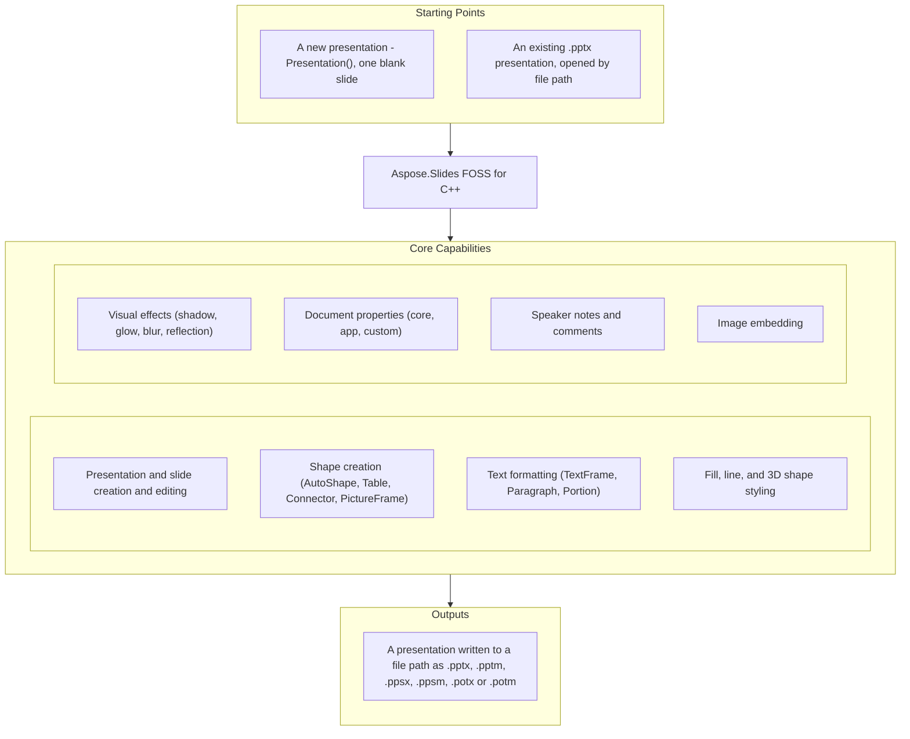

# Aspose.Slides FOSS for C++

[](LICENSE) [](CMakeLists.txt) [](https://www.nuget.org/packages/Aspose.Slides.Cpp.FOSS/) [](https://github.com/aspose-slides-foss/Aspose.Slides-FOSS-for-Cpp/graphs/contributors)

[](https://products.aspose.org/slides/cpp/)

The official open-source C++ library by Aspose.Slides for creating, reading, and editing PowerPoint
(`.pptx`) presentations. It is MIT-licensed and builds the Office Open XML package itself, so it
needs no Microsoft PowerPoint installation, no COM interop and no other proprietary runtime — only
pugixml and miniz.

## Navigation

- [At a Glance](#at-a-glance)
- [Quick Start](#quick-start)
- [Features](#features)
- [Usage Examples](#usage-examples)
- [Building](#building)
- [Installing, and using the installed package](#installing-and-using-the-installed-package)
- [Limitations](#limitations)
- [Continuous integration](#continuous-integration)
- [Packaging](#packaging)
- [Contributing, and reporting things](#contributing-and-reporting-things)
- [Documentation and resources](#documentation-and-resources)
- [License](#license)

---

## At a Glance



---

## Quick Start

```cpp
#include <Aspose/Slides/Foss/presentation.h>
#include <Aspose/Slides/Foss/slide.h>
#include <Aspose/Slides/Foss/shape_collection.h>
#include <Aspose/Slides/Foss/auto_shape.h>
#include <Aspose/Slides/Foss/shape_type.h>
#include <Aspose/Slides/Foss/export/save_format.h>

using namespace Aspose::Slides::Foss;

int main() {
    // Create a presentation. A new one has exactly one slide.
    Presentation pres;
    auto& shape = pres.slides()[0].shapes().add_auto_shape(
        ShapeType::RECTANGLE, 50, 50, 300, 100);
    shape.add_text_frame("Hello, world!");
    pres.save("new.pptx", SaveFormat::PPTX);

    // Open an existing one and save it again. The constructor throws if the
    // file is not there or is not a presentation package.
    Presentation opened("new.pptx");
    opened.save("output.pptx", SaveFormat::PPTX);
}
```

**`presentation.h` is not enough on its own.** It forward-declares the types its collections return,
so reaching through `slides()[0].shapes()` needs `slide.h` and `shape_collection.h` as well, and
using what a factory hands back needs that type's header too. Every example below lists exactly what
it needs; a missing one shows up as *use of undefined type* rather than as a missing function.

---

## Features

- **Presentation I/O** — Open, create and save `.pptx` files. A presentation this library did not
  write survives a load and a save with every part kept: the fixture in `tests/test_data/`, 13 parts
  including a layout and a master, comes back out with all 13 and its text intact.
- **Slides** — Add, remove, insert, clone, hide and iterate slides. (Cloning has a defect — see
  *Limitations*.)
- **Shapes** — AutoShapes, PictureFrames, Tables, Connectors, and reordering within a slide
- **Text** — TextFrame, Paragraph, Portion with character, paragraph and text frame formatting
  (including bullets)
- **Fill** — Solid, gradient, pattern and picture fills
- **Lines** — Width, dash style, arrows, cap, compound style, join and alignment
- **Effects** — Outer shadow, inner shadow, glow, soft edge, blur, reflection, preset shadow, fill
  overlay
- **3D** — Bevel, camera, light rig, material, extrusion depth, extrusion and contour colour
- **Document properties** — Core, app and custom properties
- **Notes slides** — Per-slide notes with header/footer management
- **Comments** — Authors, timestamps, positions, and replies. A reply is written into the classic
  comment list as a `p15:threadingInfo`/`p15:parentCm` extension on the comment, and read back, so a
  thread survives a round trip. This library does not write a `ppt/threadedComments/` part.
- **Images** — Embed from a byte range. `add_image` takes a `std::span<const std::uint8_t>` and
  there is no overload for a file path or a stream.

---

## Usage Examples

### Shapes

```cpp
#include <Aspose/Slides/Foss/presentation.h>
#include <Aspose/Slides/Foss/slide.h>
#include <Aspose/Slides/Foss/shape_collection.h>
#include <Aspose/Slides/Foss/auto_shape.h>
#include <Aspose/Slides/Foss/shape_type.h>
#include <Aspose/Slides/Foss/export/save_format.h>

using namespace Aspose::Slides::Foss;

Presentation pres;
auto& slide = pres.slides()[0];
auto& shape = slide.shapes().add_auto_shape(ShapeType::RECTANGLE, 50, 50, 300, 100);
shape.add_text_frame("Hello, world!");
pres.save("shapes.pptx", SaveFormat::PPTX);
```

### Text Formatting

```cpp
#include <Aspose/Slides/Foss/presentation.h>
#include <Aspose/Slides/Foss/slide.h>
#include <Aspose/Slides/Foss/shape_collection.h>
#include <Aspose/Slides/Foss/shape_type.h>
#include <Aspose/Slides/Foss/auto_shape.h>
#include <Aspose/Slides/Foss/text_frame.h>
#include <Aspose/Slides/Foss/paragraph.h>
#include <Aspose/Slides/Foss/portion.h>
#include <Aspose/Slides/Foss/portion_format.h>
#include <Aspose/Slides/Foss/fill_type.h>
#include <Aspose/Slides/Foss/nullable_bool.h>
#include <Aspose/Slides/Foss/drawing/color.h>
#include <Aspose/Slides/Foss/export/save_format.h>

using namespace Aspose::Slides::Foss;
using namespace Aspose::Slides::Foss::Drawing;

Presentation pres;
auto& shape = pres.slides()[0].shapes().add_auto_shape(
    ShapeType::RECTANGLE, 50, 50, 400, 150);
auto& tf = shape.add_text_frame("Formatted text");
auto& fmt = tf.paragraphs()[0].portions()[0].portion_format();
fmt.set_font_height(24.0f);
fmt.set_font_bold(NullableBool::TRUE);
fmt.fill_format().set_fill_type(FillType::SOLID);
fmt.fill_format().solid_fill_color().set_color(Color::from_argb(255, 0, 70, 127));
pres.save("text.pptx", SaveFormat::PPTX);
```

### Table

```cpp
#include <Aspose/Slides/Foss/presentation.h>
#include <Aspose/Slides/Foss/slide.h>
#include <Aspose/Slides/Foss/shape_collection.h>
#include <Aspose/Slides/Foss/table.h>
#include <Aspose/Slides/Foss/text_frame.h>
#include <Aspose/Slides/Foss/export/save_format.h>

using namespace Aspose::Slides::Foss;

// add_table takes two std::span<const double>. A braced list is not a span,
// so the widths and heights have to be objects the spans can point at.
const double column_widths[] = {120.0, 120.0, 120.0};
const double row_heights[] = {40.0, 40.0};

Presentation pres;
auto& table = pres.slides()[0].shapes().add_table(
    50, 50, column_widths, row_heights);
table.rows()[0][0].text_frame()->set_text("Name");   // Cell::text_frame() returns a pointer
table.rows()[0][1].text_frame()->set_text("Value");
pres.save("table.pptx", SaveFormat::PPTX);
```

### Connector

```cpp
#include <Aspose/Slides/Foss/presentation.h>
#include <Aspose/Slides/Foss/slide.h>
#include <Aspose/Slides/Foss/shape_collection.h>
#include <Aspose/Slides/Foss/shape_type.h>
#include <Aspose/Slides/Foss/auto_shape.h>
#include <Aspose/Slides/Foss/connector.h>
#include <Aspose/Slides/Foss/export/save_format.h>

using namespace Aspose::Slides::Foss;

Presentation pres;
auto& slide = pres.slides()[0];
auto& box1 = slide.shapes().add_auto_shape(ShapeType::RECTANGLE, 50, 100, 150, 60);
auto& box2 = slide.shapes().add_auto_shape(ShapeType::RECTANGLE, 350, 100, 150, 60);
auto& conn = slide.shapes().add_connector(
    ShapeType::BENT_CONNECTOR3, 0, 0, 10, 10);
conn.set_start_shape_connected_to(&box1);
conn.set_start_shape_connection_site_index(3);  // right
conn.set_end_shape_connected_to(&box2);
conn.set_end_shape_connection_site_index(1);    // left
pres.save("connector.pptx", SaveFormat::PPTX);
```

### Fill

```cpp
#include <Aspose/Slides/Foss/presentation.h>
#include <Aspose/Slides/Foss/slide.h>
#include <Aspose/Slides/Foss/shape_collection.h>
#include <Aspose/Slides/Foss/shape_type.h>
#include <Aspose/Slides/Foss/auto_shape.h>
#include <Aspose/Slides/Foss/fill_type.h>
#include <Aspose/Slides/Foss/drawing/color.h>
#include <Aspose/Slides/Foss/export/save_format.h>

using namespace Aspose::Slides::Foss;
using namespace Aspose::Slides::Foss::Drawing;

Presentation pres;
auto& shape = pres.slides()[0].shapes().add_auto_shape(
    ShapeType::RECTANGLE, 50, 50, 300, 150);
shape.fill_format().set_fill_type(FillType::SOLID);
shape.fill_format().solid_fill_color().set_color(Color::from_argb(255, 30, 120, 200));
pres.save("fill.pptx", SaveFormat::PPTX);
```

### Notes

```cpp
#include <Aspose/Slides/Foss/presentation.h>
#include <Aspose/Slides/Foss/slide.h>
#include <Aspose/Slides/Foss/notes_slide_manager.h>
#include <Aspose/Slides/Foss/notes_slide.h>
#include <Aspose/Slides/Foss/export/save_format.h>

using namespace Aspose::Slides::Foss;

Presentation pres;
// add_notes_slide() returns INotesSlide*, not a reference.
auto* notes = pres.slides()[0].notes_slide_manager().add_notes_slide();
notes->notes_text_frame().set_text("Speaker notes go here.");
pres.save("notes.pptx", SaveFormat::PPTX);
```

### Comments

```cpp
#include <Aspose/Slides/Foss/presentation.h>
#include <Aspose/Slides/Foss/slide.h>
#include <Aspose/Slides/Foss/comment_author_collection.h>
#include <Aspose/Slides/Foss/comment_author.h>
#include <Aspose/Slides/Foss/comment_collection.h>
#include <Aspose/Slides/Foss/comment.h>
#include <Aspose/Slides/Foss/drawing/point_f.h>
#include <Aspose/Slides/Foss/export/save_format.h>
#include <chrono>

using namespace Aspose::Slides::Foss;
using namespace Aspose::Slides::Foss::Drawing;

Presentation pres;
auto& author = pres.comment_authors().add_author("Jane Smith", "JS");
auto& slide = pres.slides()[0];

// add_comment takes the slide by reference, not by pointer.
auto& comment = author.comments().add_comment(
    "Review this slide", slide, PointF{2.0, 2.0},
    std::chrono::system_clock::now());

// A reply is a comment whose parent is set. It is written into the same
// classic comment list, carrying a p15:parentCm in its extension list.
auto& reply = author.comments().add_comment(
    "Agreed", slide, PointF{2.5, 2.5}, std::chrono::system_clock::now());
reply.set_parent_comment(&comment);

pres.save("comments.pptx", SaveFormat::PPTX);
```

### Document Properties

```cpp
#include <Aspose/Slides/Foss/presentation.h>
#include <Aspose/Slides/Foss/document_properties.h>
#include <Aspose/Slides/Foss/export/save_format.h>

using namespace Aspose::Slides::Foss;

Presentation pres;
pres.document_properties().set_title("Q1 Results");
pres.document_properties().set_author("Finance Team");
pres.document_properties().set_custom_property_value("Version", 3);
pres.save("deck.pptx", SaveFormat::PPTX);
```

---

## Building

```bash
cmake -B build -DCMAKE_BUILD_TYPE=Release
cmake --build build
```

That builds the test suite as well, which is the default at top level and means
GoogleTest is downloaded and the test translation units are compiled. To build
only the library, turn the suite off:

```bash
cmake -B build -DCMAKE_BUILD_TYPE=Release -DASPOSE_SLIDES_FOSS_BUILD_TESTS=OFF
cmake --build build
```

**Requires:** C++20 compiler, CMake 3.20+. The library is built as a static
archive: nothing in the sources is annotated for symbol export, so a shared
build would export nothing, and the build forces the static form rather than
producing a library that cannot be linked.

Dependencies. Each is looked for as an installed package first and fetched with
CMake `FetchContent` only if it is not found, so a package manager's copy is
always preferred to a private clone:

| Dependency | Version | Used for | Needed by a consumer |
|---|---|---|---|
| [pugixml](https://github.com/zeux/pugixml) | 1.14 | XML parsing | **Yes** — it appears in this library's public headers |
| [miniz](https://github.com/richgel999/miniz) | 3.0.2 | ZIP archive I/O | At link time only |
| [GoogleTest](https://github.com/google/googletest) | 1.15.2 | The test suite | No — only fetched when tests are built |

### Build options

| Option | Default | Effect |
|---|---|---|
| `ASPOSE_SLIDES_FOSS_BUILD_TESTS` | ON at top level | Build the test suite. `OFF`, or `-DBUILD_TESTING=OFF`, means no test framework is downloaded at all. |
| `ASPOSE_SLIDES_FOSS_INSTALL` | ON at top level | Generate the install and export rules. |
| `ASPOSE_SLIDES_FOSS_FETCH_DEPENDENCIES` | ON | Allow `FetchContent` to supply a dependency that was not found. Package builds set this `OFF` so a missing dependency fails loudly. |
| `ASPOSE_SLIDES_FOSS_WARNINGS_AS_ERRORS` | OFF | Treat this library's own compiler warnings as errors. |
| `ASPOSE_SLIDES_FOSS_SANITIZE_ADDRESS` | OFF | Build library and tests with AddressSanitizer. |

### Running the tests

```bash
cmake -B build -DCMAKE_BUILD_TYPE=Release
cmake --build build
ctest --test-dir build --output-on-failure
```

The suite includes the conformance tests, which assert on the bytes of the
saved `.pptx` rather than on what this library reads back; see
`tests/conformance/README.md`.

---

## Installing, and using the installed package

```bash
cmake -B build -DCMAKE_BUILD_TYPE=Release -DCMAKE_INSTALL_PREFIX=/your/prefix
cmake --build build
cmake --install build
```

The prefix then contains the headers, the static library, a generated
`Aspose/Slides/Foss/version.h`, a CycloneDX bill of materials, and a CMake
package configuration. A consumer needs nothing but the prefix:

```cmake
cmake_minimum_required(VERSION 3.20)
project(my_app LANGUAGES CXX)

find_package(AsposeSlidesFoss CONFIG REQUIRED)

add_executable(my_app main.cpp)
target_link_libraries(my_app PRIVATE AsposeSlidesFoss::AsposeSlidesFoss)
```

```bash
cmake -B build -DCMAKE_PREFIX_PATH=/your/prefix
```

`examples/consumer/` is exactly that project, and it is built and run against a
fresh install on every CI run, so the instructions above are checked rather
than asserted.

Version compatibility is `SameMinorVersion`. The version is CalVer — `YY.M.PATCH`
— so the major number is a year and carries no compatibility meaning at all:
`find_package(AsposeSlidesFoss 26.9 CONFIG REQUIRED)` accepts any `26.9.x` and
rejects `26.10`, which is the only promise a monthly release train can keep.

### Installing from NuGet on Windows

On Windows with MSVC there is a prebuilt package, so nothing has to be compiled:

```powershell
Install-Package Aspose.Slides.Cpp.FOSS
```

It carries **x64 and Win32**, **Debug and Release**, built against the DLL C
runtime (`/MD` and `/MDd`), and it needs no other configuration: the include path
and the libraries arrive from the package. Two requirements, both checked by the
package rather than left to fail obscurely:

- **Visual Studio 2022 or newer (`v143`+).** These are static archives compiled
  against a particular MSVC standard library, part of which is itself compiled
  rather than header-only. An older toolset links against an older standard
  library that lacks symbols these objects reference, and fails with `LNK2019` on
  a name from inside the standard library. The package is therefore built with the
  *oldest* toolset it supports, never the newest available.
- **C++ language standard `stdcpp20` or later**, because these headers are C++20.

Three libraries are linked, not one — `aspose_slides_foss.lib`, `pugixml.lib` and
`miniz.lib` — and pugixml's headers are on your include path as well as ours. A
static archive carries no record of what it needs, and pugixml is in this library's
public interface; see [Public headers and pugixml](#public-headers-and-pugixml).

For Linux and macOS, build from source as above. `packaging/README.md` describes
the package for each registry and what state it is in.

### Public headers and pugixml

44 of the headers a consumer includes — everything under
`include/Aspose/Slides/Foss/` outside `_internal/` — include `<pugixml.hpp>`,
and 37 of them keep a `pugi::xml_node` as a data member (45 members in all).
**A consumer therefore needs pugixml's headers, not just its library**, and the
installed
`AsposeSlidesFossConfig.cmake` calls `find_dependency(pugixml)` for that
reason. If the library is built with a fetched pugixml rather than an installed
one, that pugixml is installed into the same prefix alongside it, so the
`find_dependency` call resolves either way.

This is a leak of an implementation detail into the interface, and it is
recorded here rather than quietly fixed because the fix is not small. The
classes expose XML-backed entry points — `init_internal(pugi::xml_node, ...)`,
`get_sp_pr()`, `ensure_xfrm()` and their neighbours — which are called across
translation unit boundaries and by the test suite, so they cannot simply be
moved into a `.cpp`. Removing pugixml from the interface means giving those
classes an opaque handle or a pimpl and rewriting every one of the 172 uses of
`pugi::` in those headers along with the call sites behind them — 266 more in
the sources: a rewrite of the XML-backing layer, not an edit to the headers.

The three counts above are what these commands print today:

```sh
grep -rl 'pugixml.hpp' include/Aspose/Slides/Foss --include='*.h' | grep -v _internal | wc -l   # 44
grep -rho 'pugi::' include/Aspose/Slides/Foss --include='*.h' | wc -l                            # 246, of which
grep -rho 'pugi::' include/Aspose/Slides/Foss/_internal --include='*.h' | wc -l                  # 74 are internal -> 172
grep -rho 'pugi::' src | wc -l                                                                   # 266
```

Until that happens, the consequences to plan for are:

- pugixml must be installable and discoverable wherever this library is used;
- a consumer compiles against pugixml's headers, so a pugixml major-version
  change is a breaking change for this library too;
- pugixml is declared as an ordinary public dependency in the packaging drafts
  under `packaging/`, never as a private or vendored one.

miniz has no such problem: it appears in no installed header, is linked
privately, and is required only at link time.

---

## Limitations

### Not available at all

There is no API for these. The member named is the one that does not exist, so a call to it is a
compile error rather than a silent no-op:

| Area | What is absent |
|---|---|
| Charts, SmartArt, OLE objects, mathematical text | `ShapeCollection::add_chart` and the rest |
| Animations and slide transitions | no timeline, no transition type |
| Group shapes | `ShapeCollection::add_group_shape` |
| Hyperlinks and action settings | no `set_hyperlink_click` on a portion format or a shape |
| Slide backgrounds and themes | no `Slide::background`, no `Presentation::master_theme` |
| Sections | `Presentation::sections` |
| Slide size | `Presentation::slide_size`. A new deck is 4:3 (`cx=9144000 cy=6858000`), from the bundled template, and there is no supported way to change it |
| Saving to a stream | the only `save` overload takes a path (`std::string_view`) |
| Adding an image from a path or a stream | the only overload is `add_image(std::span<const std::uint8_t>)` |
| A `ppt/threadedComments/` part | replies are written into the classic comment list instead — see *Features* |
| Export to non-PPTX formats (PDF, HTML, SVG, images), VBA macros, digital signatures | see *Save formats* below |

### Accepted, but does not reach the file

These are defects, not design boundaries, and they are listed because the call succeeds and the
object model afterwards agrees with the caller:

- **`slides().add_clone()` loses the source shapes' text.** The clone is registered in
  `<p:sldIdLst>`, the part is written, and the shape arrives with its geometry, its `a:prstGeom` and
  its `p:style` — but the `p:txBody` holds a single empty `<a:p>` and the runs are gone.
- **`masters().add_clone()` does not reach the file.** `masters().size()` reports two afterwards;
  the saved package holds one `<p:sldMasterId>` and one `ppt/slideMasters/` part.

### Save formats

`save()` writes the six Office Open XML presentation formats: `Pptx`, `Pptm`,
`Ppsx`, `Ppsm`, `Potx` and `Potm`. They share one package layout and differ
only in the content type of the main presentation part. The macro-enabled
three are written without a VBA project, since macros are not supported.

Every other `SaveFormat` value — `Pdf`, `Html`, `Odp`, `Ppt`, image formats and
the rest — **throws `std::invalid_argument`**. It used to return successfully,
having written a PPTX under the requested name, which left the caller with a
file PowerPoint refuses to open and nothing to indicate why.

```cpp
pres.save("report.pdf", SaveFormat::PDF);  // throws std::invalid_argument
```

Note also that the format decides the content type and the file name decides
nothing: `save("deck.pptx", SaveFormat::POTX)` writes a correct template under
a `.pptx` name, and PowerPoint refuses a file whose extension and content type
disagree. Name the file for the format you asked for.

### Placeholder geometry

`Shape::x()`, `y()`, `width()` and `height()` resolve placeholder inheritance:
a placeholder with no `a:xfrm` of its own reports the position and size it
takes from its layout or master.

The XML-level accessor `Shape::get_xfrm()` does **not**. It returns this
shape's own `a:xfrm` and an empty node when there is none. It used to return
the inherited element, which lives in a layout or master part shared by every
slide that uses it and must never be handed out for mutation — and which was
parsed into a document that had already been destroyed, so reading it was
undefined behaviour. Read inherited geometry with `Shape::get_inherited_frame()`,
which returns a value. `get_inherited_xfrm()` has been removed.

### What a load and a save do to a part this library does not model

A part the library did not itself write is carried through unchanged. Opening
`tests/test_data/powerpoint_title_and_content.pptx` — 13 parts, hand-authored, with placeholders
that inherit their geometry from the layout — and saving it again produces 13 parts, no part added
and none dropped, with **10 of the 13 byte-identical** to the originals and the text preserved.

The three that differ are the three this library regenerates on every save, deliberately:
`[Content_Types].xml`, `docProps/app.xml` (the deck statistics are recounted from the slides
`<p:sldIdLst>` registers) and `docProps/core.xml` (`dcterms:modified` is stamped).

---

## Continuous integration

`.github/workflows/ci.yml` runs on every push and every pull request:

- the **full test suite** — unit, integration and conformance — on Ubuntu 22.04
  and 24.04 with both GCC and Clang, on macOS with AppleClang, and on Windows
  with MSVC on the `windows-2022` and `windows-2025` images;
- an **out-of-process check** of everything the conformance tests saved:
  `tests/conformance/validate.py` re-implements the package rules
  independently and opens every file with `python-pptx`, a reader that shares
  none of this library's assumptions. It is given a floor on the number of
  files it must find, so a corpus that quietly stopped being written fails
  instead of passing on whatever remains;
- an **install**, followed by a build and a run of `examples/consumer/` against
  that install — the check that the package is usable from outside its own
  build tree;
- an **AddressSanitizer** run of the suite;
- a build with the **oldest CMake the project claims to support**, so that
  number stays a tested claim.

Each run uploads the install tree it produced, the CycloneDX bill of materials
generated by the build, and the conformance corpus, so a reviewer can download
exactly what CI built rather than rebuilding it and hoping for the same result.

## Packaging

`packaging/` holds a **draft** vcpkg port and a **draft** Conan recipe. They are
not submittable and must not be submitted from this repository: no release has
been tagged, so neither the source reference nor the archive checksum they need
exists yet. `packaging/README.md` states the blockers precisely.

---

## Contributing, and reporting things

| Document | What it is for |
|---|---|
| [`CONTRIBUTING.md`](CONTRIBUTING.md) | how to build, how to run the suite and the out-of-process checks, which compilers have to work, and what a good pull request looks like |
| [`CHANGELOG.md`](CHANGELOG.md) | what changed, in a caller's language. Read *Changed* first if you built against an older commit |
| [`SECURITY.md`](SECURITY.md) | how to report a vulnerability privately, and what is in and out of scope |
| [`CODE_OF_CONDUCT.md`](CODE_OF_CONDUCT.md) | Contributor Covenant 2.1, and how to report a violation |

The one rule worth repeating here: **a fix to a writer ships with a test that asserts on the produced
`.pptx` package, not on what this library reads back.** A reader and a writer that share a
misunderstanding of the format agree with each other perfectly, and several of the defects fixed in
this changelog survived a green suite for exactly that reason.

---

## Documentation and resources

- **[Getting started guide](https://docs.aspose.org/slides/cpp/)** — installation, walkthroughs and
  feature guides for this library.
- **[How-to guides and FAQ](https://kb.aspose.org/slides/cpp/)** — task-focused answers to common
  PowerPoint-processing questions.
- **[API reference](https://reference.aspose.org/slides/cpp/)** — the browsable reference for the
  public API surface.
- [GitHub repository](https://github.com/aspose-slides-foss/Aspose.Slides-FOSS-for-Cpp)
- [Issue tracker](https://github.com/aspose-slides-foss/Aspose.Slides-FOSS-for-Cpp/issues) — bug
  reports and feature requests for this library.

---

## License

This project is licensed under the [MIT License](LICENSE), which permits use, copying,
modification, distribution, sublicensing and commercial use provided the copyright and permission
notice are retained. The software is provided without warranty.
